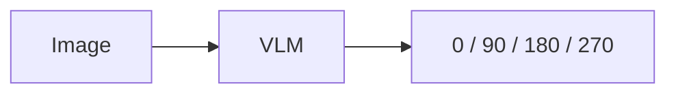
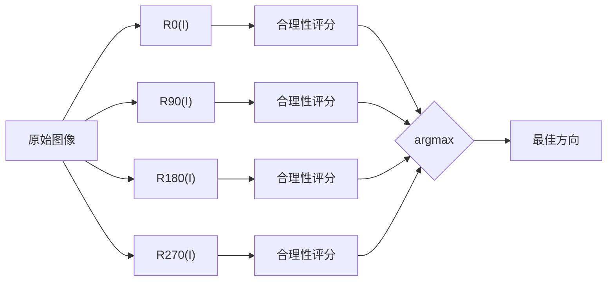

# 生成式判别原文摘录与阅读讨论

- 原文：[生成式判别](https://hailiang.feishu.cn/wiki/AWNgwGbEDiadxZkEhpLcmsf7nV9)
- 原文正文标题：从“直接预测”到“生成式判别”：VLM 的一种模型偏好
- 读取日期：2026-09-30
- 飞书文档版本：30
- 来源类型：原文选段与本次阅读讨论记录，不是原文全文。
- 证据范围：下列实验数字均由原文报告；本次未取得实验脚本或逐例输出进行独立复跑。读取日期不是文章发表日期。

## 原文摘录

以下保留原文第 2、3、6、7 节的文字与公式。原文中的判断属于作者观点，不能自动视为已验证的模型机制。

# 2. 两种任务实际上并不等价

### 方案 A：直接预测



数学上可以理解为：

$$I\rightarrow\theta$$

模型需要直接学习：

$$P(\theta|I)$$

其中 $\theta$ 是一个人为定义的离散标签。

---

### 方案 B：生成候选，再进行判别

先生成四个候选：

$$I_\theta=R_\theta(I)$$

其中：

$$\theta\in\{0^\circ,90^\circ,180^\circ,270^\circ\}$$

然后分别询问：

> 这个方向下的文档是否处于正常的阅读状态？

于是问题变成：

$$(I,\theta)\rightarrow \text{Plausibility}$$

最终：

$$\theta^*= \arg\max_\theta P(\text{Normal}|R_\theta(I))$$

问题仍然是求旋转角度，模型承担的任务却已经发生了变化。

---

# 3. 实验：两种问法的直接对比

在展开分析之前，先给数据。

我们在一批真实扫描试卷上做了一个可控实验，直接比较“问角度”（方案 A）与“验候选”（方案 B）。

### 3.1 测试集：真值自己构造，不依赖任何模型

数据来自扫描服务（批阅机算法服务）的生产日志：

- 挑出 16 张真实试卷页，覆盖 A4 竖版与 A3 横版（双栏/三栏）两类版式，学科包含数学、语文、英语、科学、历史、化学、地理，教师空白卷与学生手写卷混合；
- 每张先人工确认真实正立方向，再施加一个已知的附加顺时针旋转：

$$\theta\in\{0^\circ,90^\circ,180^\circ,270^\circ\}$$

- 得到 64 个测试实例，标准答案是“恢复正立所需的顺时针修正角”：

$$c^{*}=(360^\circ-\theta)\bmod 360^\circ$$

四个角度各 16 例，均匀分布。

因为旋转是我们自己加的，真值与任何模型的输出无关。所有候选图用同一套图像处理管线渲染（统一到相同宽度、旋转指定角度），与生产环境完全一致。

### 3.2 方法设置

| 方法 | 问法 | 每实例调用数 |
|-|-|-|
| A1 直接预测 | “这张图需要顺时针旋转多少度才能恢复正常阅读方向？只回答 0/90/180/270” | 1 |
| A2 直接预测+描述 | 先一句话描述文字当前朝向，再给出角度 | 1 |
| B1 四向穷举判别 | 对 4 个候选修正角分别渲染成图，逐张问“这页是否已正立？”，取判为“是”的那个 | 4 |
| B2 判别+早停 | 同上，按固定顺序逐张问，问到一个“是”就停 | 平均 2.5 |
| B3 四图一次对比 | 一次传 4 张候选（顺序随机打乱），问“第几张是正立的” | 1 |

B1/B2 的单张判别 prompt 就是生产里在用的那一个，没有为实验另行设计。

主模型是生产模型 qwen3.6-flash（不启用深度推理，每实例单次采样）；为排除“单个模型的偶然”，再用 qwen3-vl-plus 和 qwen-vl-max 完整复现一遍。

### 3.3 主要结果

每模型 64 实例，准确率如下：

| 方法 | qwen3.6-flash | qwen3-vl-plus | qwen-vl-max |
|-|-|-|-|
| A1 直接预测 | 73.4% | 75.0% | 71.9% |
| A2 描述+预测 | 73.4% | 73.4% | 70.3% |
| B1 四向穷举判别 | **100%** | **100%** | **100%** |
| B2 判别+早停 | **100%** | **100%** | **100%** |
| B3 四图单调用 | 96.9% | 98.4% | 98.4% |

四分类随机基线是 25%。直接预测的整体数字不算差，但把它按角度拆开，问题就暴露了。

### 3.4 错误不是随机的

A1 按真值角度分解（16 例/档）：

| 真值 $c^*$ | 0° | 90° | 180° | 270° |
|-|-|-|-|-|
| qwen3.6-flash | 16/16 | 15/16 | 16/16 | **0/16** |
| qwen3-vl-plus | 16/16 | 15/16 | 16/16 | 1/16 |
| qwen-vl-max | 16/16 | 14/16 | 16/16 | **0/16** |

需要修正 270° 的页面，三个模型合计只答对 1 次，而且错误几乎全部（47/48）落在同一个答案上：“90”。

这个错误模式很好认。一张需要顺时针转 270° 才能正立的页面，看上去就是“文字横躺、字头朝右”，等价于内容被顺时针转过了 90°。

模型回答的是**内容看起来被转过了多少度**，而题目问的是**需要转回多少度**。

这正是第 4、5 节要讨论的那次符号映射的滑倒。值得一提的是，生产代码里本来就有一个显式的换算函数在专门兜这个坑（VLM 描述的是表观角，接口需要的是修正角）。这个现象我们先是在线上靠补丁兜住，后来才通过换问法把它变成“从根上不需要”。

### 3.5 先描述再作答，也救不回来

一个更自然的补救，是让模型先看清、说清当前朝向，再做映射（A2）。

结果并没有变好。flash 上真值 270° 的 16 例里，8 例模型在描述字段里明确写对了“字头朝右”，随后在角度字段照样填了 90；描述和角度全对的只有 2 例。一条典型输出：

```json
{"orientation": "文字逆时针躺倒，字头朝右", "rotation": 90}
```

感知是对的，语言组织也是对的，最后一步符号映射照样滑掉。

问题出在“把看到的东西翻译成人为定义的角度标签”，不在“看没看见”。思维链没有义务替你补上这段本来就不在训练分布里的映射。

### 3.6 判别侧：近乎 one-hot 的合理性探针

B1 每实例问 4 次“这页正立了吗”，一个意外干净的规律是：

> 3 个模型 × 64 个实例，共 192 组四探针，**192 组全部“恰好一个方向返回 True”**。

没有一例出现“多个方向都说正立”或“没有方向说正立”。

隐式的 $P(\text{Normal}\mid I_\theta)$ 在这个任务族上的行为，几乎就是理想的指示函数：候选空间里哪个角度真的正立，哪个就亮，别的都灭。

这也是第 6 节能量模型观点最直接的证据。

- 手写答题卷与印刷卷没有明显差别（A1 在两类上的正确率都约 3/4，B1 都全对），文字行方向这个整体线索远比局部手写噪声可靠；
- B3（一次传 4 张图做对比）反而略低于逐张判别的 B1/B2，错的实例都落在相邻候选的混淆上。生产最后选择了“单图探针 + 早停”，在准确率和成本两方面都优于“四图一次对比”。

### 3.7 成本核算

每实例平均消耗（qwen3.6-flash，候选图统一到宽 480，单次探针约 318 图像 token）：

| 方法 | 平均调用数 | 平均图像 token | 平均输入 token |
|-|-|-|-|
| A1 | 1 | 318 | 462 |
| A2 | 1 | 318 | 507 |
| B1 | 4 | 1272 | 2016 |
| B2 | 2.5 | 795 | 1260 |
| B3 | 1 | 1272 | 1393 |

本实验里四个角度均匀出现，早停的期望调用数才会到 2.5。真实扫描流里正立页占大头，同一批次卷子的方向分布又高度规律（在线学习先验、双面正反差 180° 直接推断），生产里方向判定的平均调用数会持续降向 1 次，甚至 0 次。

判别侧多出来的成本，只是几次“低分辨率输入 + 一个布尔值输出”的小请求；换来的是把直接预测在难档上 0% 的准确率变成 100%。

### 3.8 实验边界

- 只覆盖 0/90/180/270 四档离散方向；任意小角度倾斜不属于本实验，那属于投影去斜一类正交方法；
- 空白页或文字极少的页面刻意排除：没有可读文字时，“是否正立”的探针会退化（哪个方向看着都像正立）。生产里这类页面走结构先验（双面正反差 180°）推断，不依赖 VLM；
- 每实例单次采样，未测温度波动；
- 未与“显式约定表观角 vs 修正角”的其他 prompt 变体对比。表观角/修正角的混淆本身就是本文分析的对象，而不是要绕开的噪声。

实验脚本与全部原始结果在项目目录（`research/rotation_vlm_ab/`）可复跑。

---

# 6. 从 Energy Model 的角度理解

这个过程也可以理解成一个简单的 Energy-Based Model。

定义一个能量函数：

$$E(I_\theta)$$

它表示：

> 当前图像状态与“正常文档”的距离。

那么旋转矫正就变成：

$$\theta^* = \arg\min_{\theta} E(R_\theta(I))$$

或者定义一个合理性分数：

$$S(I_\theta) = P(\text{Normal}|I_\theta)$$

则：

$$\theta^* = \arg\max_{\theta} S(R_\theta(I))$$

这里 VLM 的角色已经不是传统意义上的：

> **Angle Classifier**

而更像是：

> **Document Plausibility Evaluator**

它不负责直接告诉我们答案是什么，而负责判断：

> **“如果答案是这个，会不会是一个合理的世界？”**

---

# 7. 这其实是一种“Analysis by Synthesis”

这种思路在更广泛的人工智能系统中非常常见：

$$\boxed{ \text{Generate Hypothesis} \rightarrow \text{Evaluate} \rightarrow \text{Select} }$$

对于旋转问题：



这与传统的“直接预测”有一个重要区别。

直接预测：

$$I\rightarrow\theta$$

是一个**逆问题**。

而生成式判别：

$$\theta\rightarrow R_\theta(I) \rightarrow \text{Evaluate}$$

则是：

> **先提出假设，再验证假设。**

---

## 阅读讨论与概念澄清

以下为 2026-09-30 阅读讨论形成的解释和分析，与上面的原文摘录区分。

1. 方案 A 在测试现成模型的能力，没有重新训练模型。它要求模型识别朝向、依照约定确定修正角，再输出数字。错误集中在需要顺时针修正 270° 的情形，不等于完全缺乏图片与角度的映射能力。
2. 为避免混淆，使用 a 表示施加给正立原图的顺时针扰动角，使用 theta 表示对当前输入再施加的顺时针修正角。两者满足 theta = (360° - a) mod 360°。原文不同章节重复使用 theta，阅读时需要区分语义。
3. P(Normal | image) 是判断能力的数学抽象。原文实际探针输出 True/False，没有报告经过校准的连续概率。独立判断每个候选是否正立的分数，也不要求在四个候选间相加等于 1。
4. argmax 返回最高分对应的候选角度，max 返回最高分本身。四个候选恰有一个 True 时，选择该候选即可；多个 True 或全部 False 时，单靠这个规则不能唯一确认正确答案。
5. 正问题从原因、原始状态和参数产生可观察结果；逆问题从观测结果反推未知参数或原始状态。旋转正立图片得到倾斜图片是正向操作；从当前图片推断如何恢复正立，是逆问题。
6. A 与 B 都解决页面方向恢复这个逆问题。B 使用“假设角度 → 执行旋转 → 评价结果”的正向操作来搜索答案，没有把整个逆问题变成正问题。两种方案的最终业务目标相同，但交给模型的任务不同。
7. 空白页或旋转对称图案可能让多个方向同样合理，无法仅凭图像唯一恢复原始方向。这是信息和可辨识性的限制，不应一概归因于模型能力不足。
8. 候选生成可由普通图像处理程序完成。“生成式判别”在本文中描述的是任务组织方式，不能据此认定它是一个经过专门训练的生成模型或能量模型。若有正的合理性分数 S，可定义 E = -log S，把最大化分数等价写成最小化能量；这只是数学重述。
9. 16 张原始试卷各生成四个旋转版本，共 64 个实例，实例之间存在同源相关性。三个模型在这个集合上得到相似结果，是有价值的任务内证据，不能证明所有 VLM、所有文档或所有逆问题都适用。
10. 作者将主要错误解释为表观角和修正角混淆。错误分布与这种解释相符，但实验没有隔离所有机制，也未比较更明确的角度约定或训练干预，不能认定它证明了模型内部缺少某个映射模块或拥有特定世界模型。
11. 早停和全量 argmax 不是一般等价的算法。早停会受候选顺序和误报影响；只有验证器足够可靠且任务存在可接受候选时，才适合按接受规则停止。原文的 2.5 次调用来自四个角度均匀分布与其报告的判别结果。
12. 原文对可推广性的讨论应当作为工程假设。要落地，应评估候选是否覆盖正确答案、验证器误报漏报、多个或零个候选通过时的处理，以及总成本和延迟。没有合适候选时，强行 argmax 仍会给出一个答案。

## 工程提炼与知识关联

以下为基于原文和讨论的工程建议，不是原文已验证的新实验结果。

- 优先考虑候选空间小、生成便宜、结果可观察、验证比直接输出参数更可靠的任务。候选空间巨大时，要先控制候选召回与搜索成本。
- 由确定性程序负责旋转、角度记账、停止条件和结果选择；模型承担具有语义歧义的正立判断。这可作为现有 Agent 架构中控制策略与验证机制分工的一个实例，单纯四向穷举并不要求自主 Agent 或多 Agent。
- 与 Program-as-Weights 的联系是“将语义判断与确定性控制分工”；两者技术机制不同。前者涉及编译权重，本文方法可仅通过任务改写与外部候选枚举实现。
- 工程评测应按原始页面分组划分样本，覆盖四个方向、版式和低文字量页面，并记录唯一命中、多命中、零命中、误接受、误拒绝、调用次数和实际耗时。
- 选择策略应允许拒绝或转入备用流程。空白页、小角度歪斜、错误候选和模型波动都需要单独评估，不能用这次有限集合上的 100% 替代生产验证。
